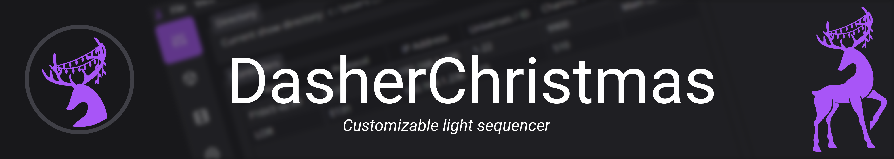

 

[![Build Status][github-actions-status]][github-actions-url]
[![Github Tag][github-tag-image]][github-tag-url]

## Install

**Having issues installing? See the [faq page]().**

## Effect Development Docs

See the [docs and guides here]().

<!--
## Community

## Donations

**Donations will ensure the following:**

- 🔨 Long term maintenance of the project
- 🐛 Quick responses to bug reports and help requests
-->

## Maintainers

- [ErrorGamer2000](https://github.com/errorgamer2000)

## Libraries

  Dasher Christmas is built on top of <a href="https://github.com/electron-react-boilerplate/electron-react-boilerplate">Electron React Boilerplate</a> and uses <a href="https://electron.atom.io/">Electron</a>, <a href="https://facebook.github.io/react/">React</a>, <a href="https://github.com/reactjs/react-router">React Router</a>, and <a href="https://webpack.js.org/">Webpack</a>.

## License

MIT © [ErrorGamer2000](https://github.com/errorgamer2000)

[github-actions-status]: https://github.com/DasherChristmas/Dasher/workflows/Test/badge.svg
[github-actions-url]: https://github.com/DasherChristmas/Dasher/actions
[github-tag-image]: https://img.shields.io/github/tag/DasherChristmas/Dasher.svg?label=version
[github-tag-url]: https://github.com/DasherChristmas/Dasher/releases/latest
[stackoverflow-img]: https://img.shields.io/badge/stackoverflow-electron_react_boilerplate-blue.svg
